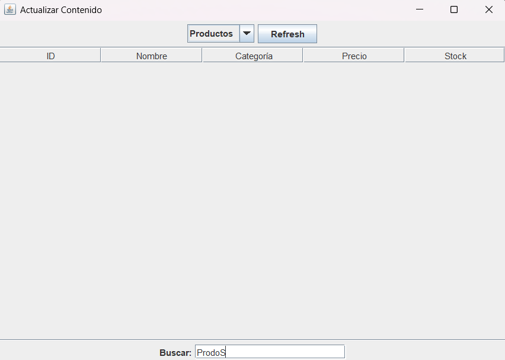
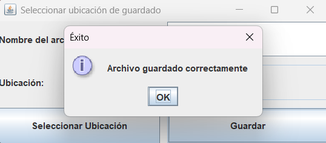

# GestorDeReportes
Gestor de Reportes

## Menú Principal

La primera ventana que se te abrira sera el menú principal, con los siguientes botones:
 - [Ver Contenido]()
 - [Añadir Contenido]()
 - [Actualizar Contenido]()
 - [Borrar Contenido]()
 - [Generar Reporte]()
 - [Salir]()

## Ver Contenido

## Añadir Contenido

## Actualizar Contenido

## Borrar Contenido

## Generar Reporte

## Salir

Simplementa es para cerrar el programa.